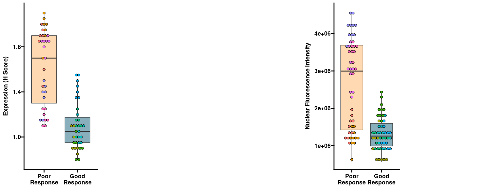
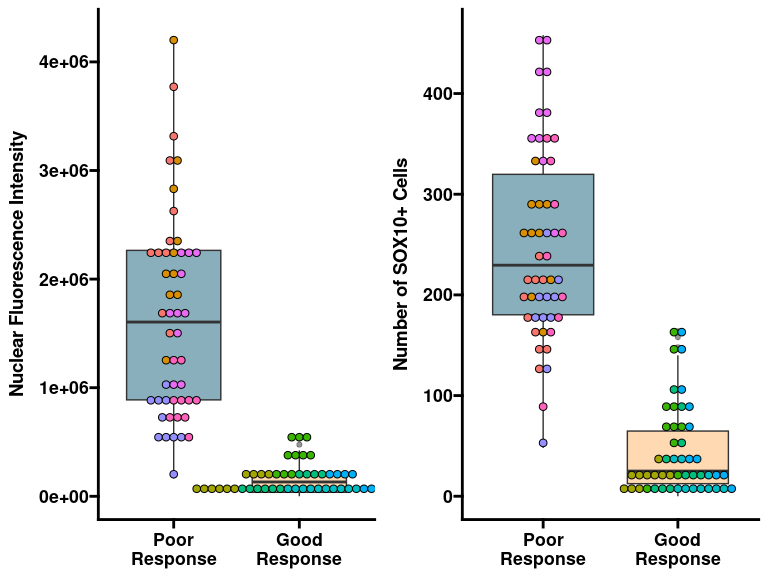
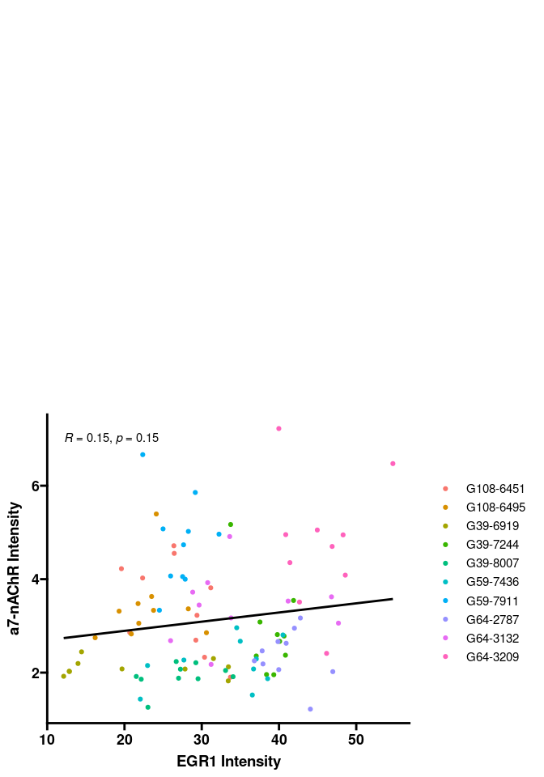
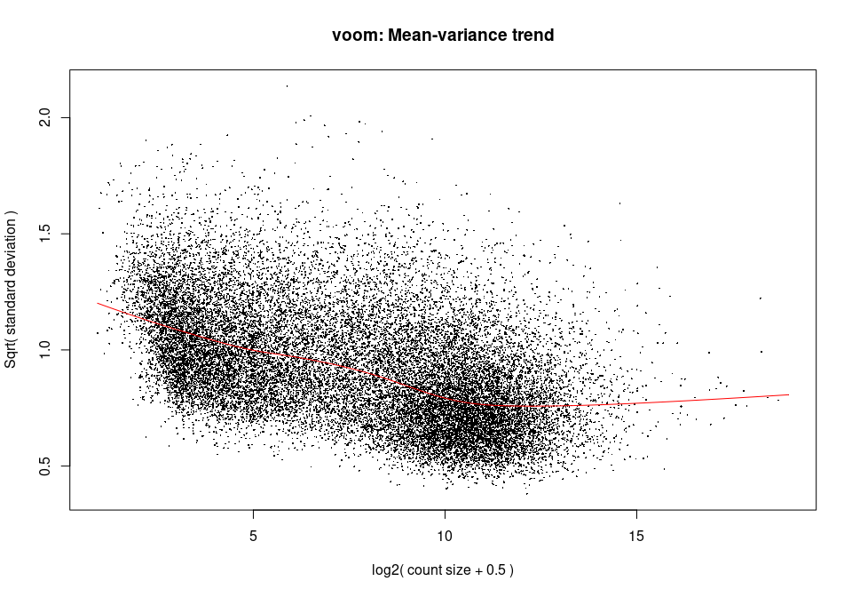

Tumors that respond poorly to bevacizumab show upregulation of
angiogenesis genes.
================
Roshan Lodha
09 February, 2024

# Bulk RNA-sequencing analysis

## Loading required packages and tools

## Preprocessing

<!-- -->

## Postprocessing

## Bulk-RNA Analysis

### DGE Plot

<!-- -->

### GSEA Plot

    ## # A tibble: 23 × 2
    ##    gs_cat gs_subcat        
    ##    <chr>  <chr>            
    ##  1 C1     ""               
    ##  2 C2     "CGP"            
    ##  3 C2     "CP"             
    ##  4 C2     "CP:BIOCARTA"    
    ##  5 C2     "CP:KEGG"        
    ##  6 C2     "CP:PID"         
    ##  7 C2     "CP:REACTOME"    
    ##  8 C2     "CP:WIKIPATHWAYS"
    ##  9 C3     "MIR:MIRDB"      
    ## 10 C3     "MIR:MIR_Legacy" 
    ## # ℹ 13 more rows

<!-- -->

### Angiogenesis Gene Expression Plot

### Collagen Gene Expression Plot

### Figure 1

<!-- -->

# Protein Level Analysis

## EGR1 Expression

### Figure 2

<!-- -->

## Non-EGR1 Expression

### a7-nAChR Intensity

### SOX10 Expression

<!-- -->

## Correlation between a7-nAChR and EGR1

### Figure 3

<!-- -->

# Survival Analysis

## GBM Analysis

### TCGA RNA Analysis

#### EGR1-Stratified Angiogenesis Expression

#### EGR1-Stratified Collagen Expression

#### EGR1-Stratified Average Expression Boxplot

#### EGR1-Stratified Survival Plot

##### EGR1-Stratified Recurrent Tumor Survival Plot

<!-- -->

<!-- -->

### Figure 5

<!-- -->

## Other Cancers

### Pan-Cancer Analysis

### Lung Cancer Analysis

## Other Genes

### CHRNA7 Survival Plot

### SOX10 Survival Plot

### EGR3 Survival Plot

### RAMP3 Survival Plot

### Other Genes Plot

<!-- -->
