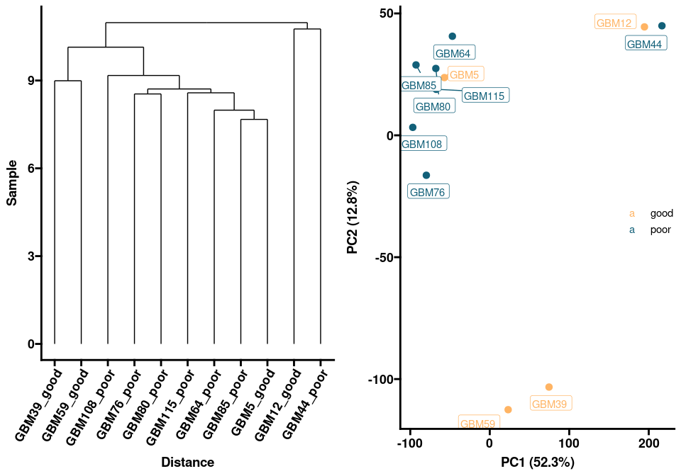

Molecular Phenotype of Bevacizumab Responders
================
Roshan Lodha
2022-04-04

## PCA

### Prefiltered

``` r
design <- read_tsv("raw/prefilterstudydesign.txt")
sampleLabels <- design$sample
group <- factor(design$group)

gbmexpr <- read_csv("raw/prefiltergbmexpr.csv")[2:13] #pre-filtered
gbmexpr.matrix <- as.matrix(gbmexpr[,-1])
rownames(gbmexpr.matrix) <- unlist(gbmexpr[,1])
myDGEList <- DGEList(gbmexpr.matrix)
myDGEList.filtered.norm <- calcNormFactors(myDGEList, method = "TMM") #normalize using TMM
log2.tpm.filtered.norm <- log2(gbmexpr.matrix+1)
log2.tpm.filtered.norm.df <- as_tibble(log2.tpm.filtered.norm, rownames = "geneID")
```

``` r
distance <- dist(t(log2.tpm.filtered.norm), method = "maximum")
clusters <- hclust(distance, method = "average")
den <- ggdendrogram(clusters) +
  labs(title="B. GBM PDX Dendrogram") +
  xlab("Distance") + 
  ylab("Sample") +
  theme_prism() +
  theme(axis.text.x = element_text(angle = 60, vjust = 1, hjust=1))

sampleLabels <- substr(sampleLabels, 1, nchar(sampleLabels)-5)
pca.res <- prcomp(t(log2.tpm.filtered.norm), scale.=F, retx=T)
pc.var <- pca.res$sdev^2
pc.per <- round(pc.var/sum(pc.var)*100, 1) 
pca.res.df <- as_tibble(pca.res$x)
pca.plot <- ggplot(pca.res.df) +
  aes(x=PC1, y=PC2, label=sampleLabels, color = group) +
  geom_point(size=3) +
  geom_label_repel(aes(label=sampleLabels),hjust=0, vjust=0) +
  scale_color_manual(values=c("#ffb464", "#126079")) +
  xlab(paste0("PC1 (",pc.per[1],"%",")")) + 
  ylab(paste0("PC2 (",pc.per[2],"%",")")) +
  labs(title="A. GBM PDX PCA Plot") +
  theme_prism() +
  theme(legend.position = c(0.9, 0.5))

ggarrange(pca.plot, den, ncol = 2, nrow = 1)
```

<!-- -->

### Cleaning

``` r
design <- read_tsv("raw/studydesign.txt")
sampleLabels <- design$sample
group <- factor(design$group)
mm <- model.matrix(~0 + group)

counts <- read.table(file = "./raw/counts.tabular", header=TRUE, sep="\t")
colnames(counts) <- c("geneID", sampleLabels)
counts$gene <- getSYMBOL(as.character(counts$geneID), data='org.Hs.eg')
counts <- counts %>% select(gene, everything())
counts <- counts[rowSums(counts <= 0) <= 3, ] %>% drop_na() #filter: at most 3 zeros
counts.matrix <- as.matrix(counts[3:11])
rownames(counts.matrix) <- counts$gene
```

<!-- -->

## DGE

### Cleaning

``` r
coding_genes <- getBM(attributes = c( "hgnc_symbol"), 
                      filters = c("biotype"), 
                      values = list(biotype="protein_coding"), 
                      mart = mart)$hgnc_symbol

rownames(counts.matrix) <- counts$geneID
dds <- DESeqDataSetFromMatrix(countData = round(counts.matrix),
                              colData = design,
                              design = ~ group)

keep <- rowSums(counts(dds)) >= 0 #original
dds <- dds[keep,]
dds <- DESeq(dds)
dds <- estimateSizeFactors(dds)
deseqvoom <- voom(counts(dds, normalized=TRUE), mm, plot = T)
```

<!-- -->

``` r
keep <- rowSums(counts(dds)) >= 350 #determined via hyperparameter exploration
dds <- dds[keep,]
dds <- DESeq(dds)
dds <- estimateSizeFactors(dds)
deseqvoom <- voom(counts(dds, normalized=TRUE), mm, plot = T)
```

<!-- -->

### DeSeq2

``` r
res <- results(dds)
res <- lfcShrink(dds, coef="group_poor_vs_good", type="ashr")
deseq <- as.data.frame(res) %>% drop_na() %>% arrange(padj) %>% arrange(desc(abs(log2FoldChange)))
deseq$gene <- getSYMBOL(rownames(deseq), data='org.Hs.eg')
deseq <- dplyr::filter(deseq, gene %in% coding_genes)
deseq <- deseq %>%
  mutate(enrichment = case_when(
    (padj < 0.05) & (log2FoldChange > 1) ~ "poor",
    (padj < 0.05) & (log2FoldChange < -1) ~ "good"))
deseq$enrichment[is.na(deseq$enrichment)] <- "none"
rownames(deseq) <- deseq$gene
head(deseq)
```

    ##         baseMean log2FoldChange    lfcSE       pvalue         padj   gene
    ## MXRA5  1750.1319       10.86348 2.061024 1.359533e-10 1.273765e-08  MXRA5
    ## FIGNL2  435.1366       10.61177 1.348714 7.843047e-18 2.834328e-15 FIGNL2
    ## DPP10  2909.8972       10.53996 2.363516 8.934627e-09 5.136734e-07  DPP10
    ## SHD    3317.4611       10.53748 1.089398 1.071234e-24 1.250707e-21    SHD
    ## IGLON5 2936.8613       10.40381 1.598737 1.902536e-13 3.244572e-11 IGLON5
    ## SYT13   925.2864       10.35292 1.921826 1.505273e-10 1.393111e-08  SYT13
    ##        enrichment
    ## MXRA5        poor
    ## FIGNL2       poor
    ## DPP10        poor
    ## SHD          poor
    ## IGLON5       poor
    ## SYT13        poor

``` r
ggplot(deseq) +
  aes(y=-log10(padj), x=log2FoldChange, colour=enrichment) +
  scale_color_manual(values = c("good" = "#126079", "none"="grey", "poor"="#ffb464")) +
  geom_point(size=1.5, alpha=0.25) +
  #facet_zoom(xlim = c(9, 11), zoom.size = 1) +
  geom_rect(mapping=aes(xmin=9, xmax=11, ymin=2, ymax=54), alpha=0, color='black') +
  geom_text_repel(size=4, data=head(deseq, 20), aes(label=gene), max.overlaps = Inf, colour="black") +
  #geom_text_repel(size=3, data=subset(deseq, gene == 'EGR1'), aes(label=gene)) + 
  geom_hline(yintercept = -log10(0.05), linetype="longdash", colour="black", size=.5) +
  geom_text(aes(-8, -log10(0.05), label = "p = 0.05", vjust = 1), colour="black") +
  labs(title="A. Differential RNA Expression") +
       #subtitle="Positive logFC indicates upregulation in poor Bevacizumab responders") +
  xlab("Fold Change (log2)") +
  ylab("Significance (log10)") +
  theme_prism() + 
  theme(legend.position = c(0.15, 0.8))
```

<!-- -->

``` r
search <- function(x) {
  print(deseq %>% filter(grepl(x, gene)))
}
search("COL")
```

    ##             baseMean log2FoldChange     lfcSE       pvalue         padj
    ## COL11A2     42.81190     6.70470389 1.8168094 8.674491e-06 1.962167e-04
    ## COL9A1   10530.06472     6.62876864 1.5705517 1.833236e-06 5.466572e-05
    ## COL9A2    7894.09913     4.71631393 0.6846981 2.268200e-12 3.101508e-10
    ## COL2A1    2222.94755     4.66203029 1.4924125 7.162909e-05 1.108243e-03
    ## COL8A1    2995.34626    -3.92238970 1.4119256 1.471533e-04 1.976542e-03
    ## COL5A3    1464.44502     3.49648704 1.1750489 8.106620e-05 1.225521e-03
    ## COL16A1   9849.29648     3.27219645 0.6807929 2.025878e-07 8.177867e-06
    ## PCOLCE    6073.16330     3.06958979 1.4870383 6.360658e-04 6.444731e-03
    ## COLEC12    101.14685     2.30610151 1.8377209 5.132068e-03 3.264649e-02
    ## COL11A1  10708.49341     2.27002842 1.8487046 5.559622e-03 3.464037e-02
    ## COL20A1  18147.36145     2.23023397 1.7004248 4.453440e-03 2.945286e-02
    ## COL25A1    314.87775    -1.69300428 1.4726275 8.154375e-03 4.632002e-02
    ## COL7A1    2542.98225     1.42347161 0.8948217 2.579776e-03 1.927909e-02
    ## COL8A2    1424.65800     1.27117812 1.4165151 2.179467e-02 9.411079e-02
    ## COL18A1   3618.23830     0.81496158 0.7679585 3.038783e-02 1.191198e-01
    ## COLGALT2 14204.94598    -0.79609031 0.8439871 3.900016e-02 1.414714e-01
    ## COL5A2   12663.29354    -0.79024074 0.8075338 3.728271e-02 1.371158e-01
    ## COL5A1    6305.38710     0.78776603 1.2465859 7.408451e-02 2.165745e-01
    ## COL19A1   3249.49574    -0.67562185 1.1756986 1.005917e-01 2.642404e-01
    ## COL15A1    138.52109     0.60718654 0.9138811 9.765048e-02 2.593873e-01
    ## COL4A5    8203.81227    -0.48794155 0.9371339 1.629106e-01 3.622410e-01
    ## COL23A1     87.04103     0.46770153 1.0112010 1.878078e-01 3.940486e-01
    ## COLQ       485.80880     0.46200902 0.6050591 1.413298e-01 3.305970e-01
    ## COL22A1   4695.40849     0.41426088 0.7673259 1.954535e-01 4.034826e-01
    ## COLGALT1 12167.56325    -0.37829578 0.3742711 1.783559e-01 3.820330e-01
    ## COL6A1   57358.71911    -0.28553346 0.4635202 3.288240e-01 5.505621e-01
    ## COL21A1    413.03344    -0.26286682 0.8427260 3.890257e-01 6.074099e-01
    ## COL27A1   5428.41651     0.25244673 0.5133696 3.838283e-01 6.025180e-01
    ## COL9A3   19188.20018     0.24023738 0.5342005 4.041386e-01 6.223004e-01
    ## PCOLCE2    499.58987     0.11669680 0.5281652 6.753963e-01 8.273073e-01
    ## COLEC11     53.05505     0.10597236 0.6245886 6.965441e-01 8.409949e-01
    ## COL4A2   20778.96581    -0.09240573 0.5605187 7.356795e-01 8.652718e-01
    ## COL6A2   19789.01514    -0.07906809 0.4485715 7.816350e-01 8.914041e-01
    ## COL1A2   24359.02632    -0.05575863 0.6818892 8.369124e-01 9.221529e-01
    ## COL4A1   11918.57807     0.05200886 0.5345854 8.499306e-01 9.286794e-01
    ## COLCA2     221.22451     0.04117557 0.5984914 8.781871e-01 9.451668e-01
    ## COL24A1    310.79943    -0.03760114 0.7274935 8.909838e-01 9.516440e-01
    ## MCOLN2     166.20586     0.03634453 0.8486920 8.999638e-01 9.561529e-01
    ## COL28A1    411.85156     0.02538213 0.5531756 9.256162e-01 9.681068e-01
    ## MCOLN1    2257.01961     0.01901399 0.3455685 9.438308e-01 9.759399e-01
    ## COL12A1   6347.01239     0.01572708 0.6630544 9.533242e-01 9.787254e-01
    ##              gene enrichment
    ## COL11A2   COL11A2       poor
    ## COL9A1     COL9A1       poor
    ## COL9A2     COL9A2       poor
    ## COL2A1     COL2A1       poor
    ## COL8A1     COL8A1       good
    ## COL5A3     COL5A3       poor
    ## COL16A1   COL16A1       poor
    ## PCOLCE     PCOLCE       poor
    ## COLEC12   COLEC12       poor
    ## COL11A1   COL11A1       poor
    ## COL20A1   COL20A1       poor
    ## COL25A1   COL25A1       good
    ## COL7A1     COL7A1       poor
    ## COL8A2     COL8A2       none
    ## COL18A1   COL18A1       none
    ## COLGALT2 COLGALT2       none
    ## COL5A2     COL5A2       none
    ## COL5A1     COL5A1       none
    ## COL19A1   COL19A1       none
    ## COL15A1   COL15A1       none
    ## COL4A5     COL4A5       none
    ## COL23A1   COL23A1       none
    ## COLQ         COLQ       none
    ## COL22A1   COL22A1       none
    ## COLGALT1 COLGALT1       none
    ## COL6A1     COL6A1       none
    ## COL21A1   COL21A1       none
    ## COL27A1   COL27A1       none
    ## COL9A3     COL9A3       none
    ## PCOLCE2   PCOLCE2       none
    ## COLEC11   COLEC11       none
    ## COL4A2     COL4A2       none
    ## COL6A2     COL6A2       none
    ## COL1A2     COL1A2       none
    ## COL4A1     COL4A1       none
    ## COLCA2     COLCA2       none
    ## COL24A1   COL24A1       none
    ## MCOLN2     MCOLN2       none
    ## COL28A1   COL28A1       none
    ## MCOLN1     MCOLN1       none
    ## COL12A1   COL12A1       none

### DeSeq Exploration

#### KDR

#### Blood Vessel

``` r
blood_vessel <- scan("./raw/blood_vessel_geneset.txt", character(), quote = "")
blood_vessel <- deseq %>% filter((gene %in% blood_vessel) 
                                 & (enrichment!="none")
                                 & (abs(log2FoldChange) > 4))
blood_vessel
```

    ##             baseMean log2FoldChange     lfcSE       pvalue         padj
    ## APOD      9759.92427       7.828917 1.3906118 8.919563e-10 6.803072e-08
    ## GATA4      679.90425       7.321148 1.0463054 2.330669e-13 3.763286e-11
    ## KDR       3362.89226      -7.122849 0.8464313 4.341158e-18 1.733950e-15
    ## ACVRL1     183.50506       6.686054 1.4027405 1.957494e-07 7.965374e-06
    ## RAMP3       40.42002       6.394297 1.9945744 3.169374e-05 5.786075e-04
    ## LAMA1     1026.83104       6.172626 1.0763464 1.794661e-09 1.243807e-07
    ## ADGRB1   19257.30634       5.748150 1.0761494 2.040503e-08 1.077392e-06
    ## JCAD       721.65613       5.704425 1.4559027 7.914356e-06 1.817309e-04
    ## SFRP1     1217.43271       5.534804 1.3447558 4.554527e-06 1.161825e-04
    ## TAL1       184.04294       5.361910 1.3590453 8.160965e-06 1.860695e-04
    ## PPP1R16B  1180.88138       5.164401 1.3785405 1.502825e-05 3.124641e-04
    ## NGFR     23351.69478       5.160191 1.4786604 2.896675e-05 5.355145e-04
    ## EPHB1     3223.42650       4.982258 1.2607837 8.630066e-06 1.955032e-04
    ## AMOT      2745.48695       4.933340 0.9914015 1.759676e-07 7.257707e-06
    ## CHRNA7      63.87601       4.445756 1.9596493 4.034568e-04 4.496085e-03
    ## NPR1      1314.44689       4.195734 1.4415146 1.137522e-04 1.592741e-03
    ## EGR3      2077.31025       4.168716 0.9590525 2.270439e-06 6.502024e-05
    ## CAV1      6747.61924      -4.164415 1.3288299 6.879643e-05 1.070966e-03
    ## HOXB13    2159.35870       4.145035 1.2873413 5.613837e-05 9.135591e-04
    ##              gene enrichment
    ## APOD         APOD       poor
    ## GATA4       GATA4       poor
    ## KDR           KDR       good
    ## ACVRL1     ACVRL1       poor
    ## RAMP3       RAMP3       poor
    ## LAMA1       LAMA1       poor
    ## ADGRB1     ADGRB1       poor
    ## JCAD         JCAD       poor
    ## SFRP1       SFRP1       poor
    ## TAL1         TAL1       poor
    ## PPP1R16B PPP1R16B       poor
    ## NGFR         NGFR       poor
    ## EPHB1       EPHB1       poor
    ## AMOT         AMOT       poor
    ## CHRNA7     CHRNA7       poor
    ## NPR1         NPR1       poor
    ## EGR3         EGR3       poor
    ## CAV1         CAV1       good
    ## HOXB13     HOXB13       poor

``` r
goi <- blood_vessel$gene
b_v_heatmap <- counts %>% filter(gene %in% goi) %>% dplyr::select(-geneID)
rownames(b_v_heatmap) <- b_v_heatmap$gene
b_v_heatmap <- b_v_heatmap %>% dplyr::select(-gene)
b_v_heatmap <- as.data.frame(t(b_v_heatmap))
b_v_heatmap$sample <- rownames(b_v_heatmap)
rownames(b_v_heatmap) <- NULL
b_v_heatmap$group <- gsub("GBM[0-9]*_", "", b_v_heatmap$sample)
b_v_heatmap <- b_v_heatmap %>% pivot_longer(cols = -c("sample", "group"),
                                            names_to = "gene",
                                            values_to = "expression")

b_v_heatmap$log.expr <- log(b_v_heatmap$expression+1)
b_v_heatmap$sample <- substr(b_v_heatmap$sample,1,nchar(b_v_heatmap$sample)-5)

ggplot(data = b_v_heatmap, mapping = aes(x = sample, 
                                         y = gene,
                                         fill = log.expr)) +
  geom_tile() +
  scale_fill_gradient(high = "#ffb464", low = "#126079") +
  scale_colour_prism(palette = "colors") +
  xlab(label = "Patient Derived Xenograft") + # Add a nicer x-axis title
  ggtitle("C. Angiogenic Gene RNA Expression") +
  facet_grid(~ group, switch = "x", scales = "free_x", space = "free_x") + 
  #labs(color = "Your title here") +
  theme_prism() +
  theme(axis.title.y = element_blank(),
        axis.text.x = element_text(angle = 60, vjust = 0.7),
        legend.position = "bottom")
```

<!-- -->

## GSEA

``` r
hs_gsea <- msigdbr(species = "Homo sapiens")
hs_gsea %>% dplyr::distinct(gs_cat, gs_subcat) %>% dplyr::arrange(gs_cat, gs_subcat)
```

    ## # A tibble: 23 × 2
    ##    gs_cat gs_subcat        
    ##    <chr>  <chr>            
    ##  1 C1     ""               
    ##  2 C2     "CGP"            
    ##  3 C2     "CP"             
    ##  4 C2     "CP:BIOCARTA"    
    ##  5 C2     "CP:KEGG"        
    ##  6 C2     "CP:PID"         
    ##  7 C2     "CP:REACTOME"    
    ##  8 C2     "CP:WIKIPATHWAYS"
    ##  9 C3     "MIR:MIR_Legacy" 
    ## 10 C3     "MIR:MIRDB"      
    ## # … with 13 more rows

``` r
hs_gsea_h <- msigdbr(species = "Homo sapiens",
                      category = "H") %>%
  dplyr::select(gs_name, gene_symbol)
hs_gsea_kegg <- msigdbr(species = "Homo sapiens",
                     category = "C2",
                     subcategory = "CP:KEGG") %>%
  dplyr::select(gs_name, gene_symbol)

deseq.GSEA.select <- dplyr::select(deseq, gene, log2FoldChange, padj)
deseq.gsea <- abs(deseq.GSEA.select$log2FoldChange)/deseq.GSEA.select$log2FoldChange * -log10(deseq.GSEA.select$padj)
names(deseq.gsea) <- as.character(deseq.GSEA.select$gene)
deseq.gsea <- sort(deseq.gsea, decreasing = TRUE)
deseq.gsea.res <- GSEA(deseq.gsea, pvalueCutoff = 1, TERM2GENE=hs_gsea_h, verbose=FALSE)
deseq.GSEA.df <- as_tibble(deseq.gsea.res@result)
deseq.GSEA.df <- deseq.GSEA.df %>%
  mutate(phenotype = case_when(
    (NES > 0) & (p.adjust<0.05) ~ "poor",
    (NES < 0) & (p.adjust<0.05) ~ "good"))
deseq.GSEA.df$phenotype[is.na(deseq.GSEA.df$phenotype)] <- "none"
deseq.GSEA.df$Description <- gsub("_", " ", deseq.GSEA.df$Description)
```

``` r
ggplot(deseq.GSEA.df, aes(x=NES, y=-log10(p.adjust), color=phenotype)) + 
  geom_point(aes(size=setSize), alpha=0.5) +
  scale_color_manual(values = c("good" = "#126079", "none"="grey", "poor"="#ffb464")) +
  geom_text(aes(-1.5, -log10(0.05), label = "p = 0.05", vjust = -1)) +
  geom_hline(yintercept = -log10(0.05), linetype="longdash", size=.5) +
  geom_text_repel(size=4, data=(deseq.GSEA.df %>% dplyr::filter((NES > 0) & (p.adjust < 0.05)))[1,], 
                  aes(label=Description)) +
  labs(title="B. Hallmark Gene Set Enrichment") +
  #     subtitle="Positive NES indicates upregulation of gene set in poor Bevacizumab responders") +
  ylab("Significance (log10)") +
  xlab("Normalized Enrichment Score") +
  theme_prism() +
  theme(legend.position = "bottom")
```

<!-- -->

## Survival Analysis

### EGR1

### CHRNA7

## Immunohistory Chemistry
