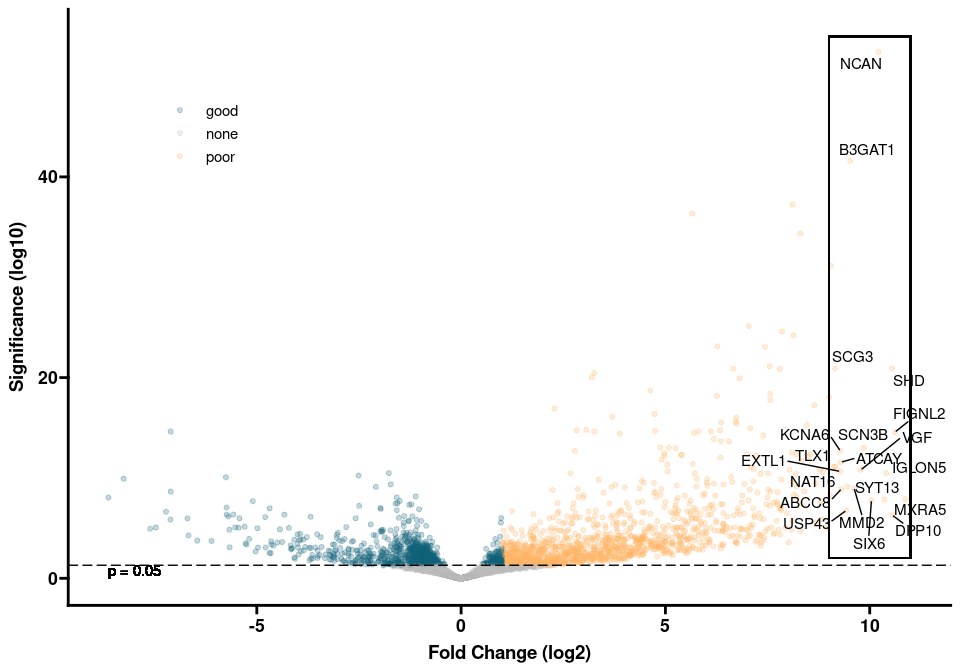
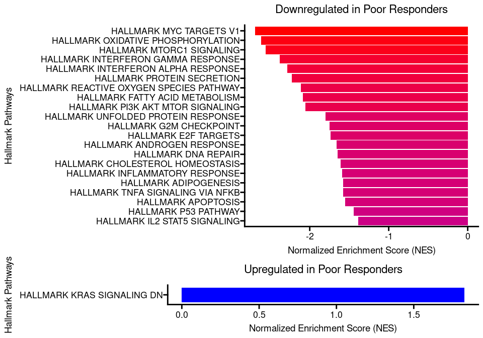
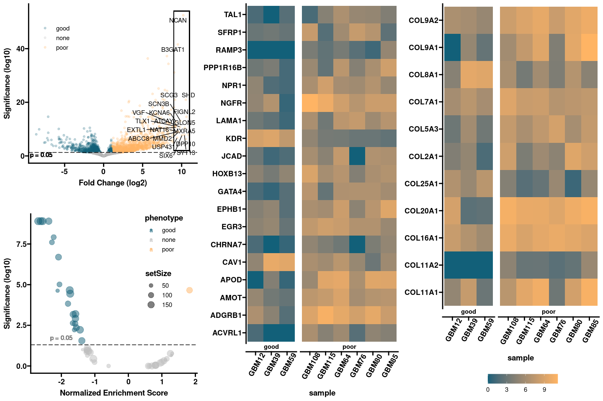

Tumors that respond poorly to bevacizumab show upregulation of
angiogenesis genes.
================
Roshan Lodha
09 February, 2024

- [Bulk RNA-sequencing analysis](#bulk-rna-sequencing-analysis)
  - [Loading required packages and
    tools](#loading-required-packages-and-tools)
  - [Preprocessing](#preprocessing)
  - [Postprocessing](#postprocessing)
  - [Bulk-RNA Analysis](#bulk-rna-analysis)
    - [DGE Plot](#dge-plot)
    - [GSEA Plot](#gsea-plot)
    - [Angiogenesis Gene Expression
      Plot](#angiogenesis-gene-expression-plot)
    - [Collagen Gene Expression Plot](#collagen-gene-expression-plot)
    - [Figure 1](#figure-1)
- [Protein Level Analysis](#protein-level-analysis)
  - [EGR1 Expression](#egr1-expression)
    - [Figure 2](#figure-2)
  - [Non-EGR1 Expression](#non-egr1-expression)
    - [a7-nAChR Intensity](#a7-nachr-intensity)
    - [SOX10 Expression](#sox10-expression)
  - [Correlation between a7-nAChR and
    EGR1](#correlation-between-a7-nachr-and-egr1)
    - [Figure 3](#figure-3)
- [Survival Analysis](#survival-analysis)
  - [GBM Analysis](#gbm-analysis)
    - [TCGA RNA Analysis](#tcga-rna-analysis)
      - [EGR1-Stratified Angiogenesis
        Expression](#egr1-stratified-angiogenesis-expression)
      - [EGR1-Stratified Collagen
        Expression](#egr1-stratified-collagen-expression)
      - [EGR1-Stratified Average Expression
        Boxplot](#egr1-stratified-average-expression-boxplot)
      - [EGR1-Stratified Survival Plot](#egr1-stratified-survival-plot)
    - [Figure 5](#figure-5)
  - [Other Cancers](#other-cancers)
    - [Pan-Cancer Analysis](#pan-cancer-analysis)
    - [Lung Cancer Analysis](#lung-cancer-analysis)
  - [Other Genes](#other-genes)
    - [CHRNA7 Survival Plot](#chrna7-survival-plot)
    - [SOX10 Survival Plot](#sox10-survival-plot)
    - [EGR3 Survival Plot](#egr3-survival-plot)
    - [RAMP3 Survival Plot](#ramp3-survival-plot)
    - [Other Genes Plot](#other-genes-plot)

# Bulk RNA-sequencing analysis

## Loading required packages and tools

## Preprocessing

<!-- -->

## Postprocessing

## Bulk-RNA Analysis

### DGE Plot

<!-- -->

<!-- -->

### GSEA Plot

    ## # A tibble: 23 × 2
    ##    gs_cat gs_subcat        
    ##    <chr>  <chr>            
    ##  1 C1     ""               
    ##  2 C2     "CGP"            
    ##  3 C2     "CP"             
    ##  4 C2     "CP:BIOCARTA"    
    ##  5 C2     "CP:KEGG"        
    ##  6 C2     "CP:PID"         
    ##  7 C2     "CP:REACTOME"    
    ##  8 C2     "CP:WIKIPATHWAYS"
    ##  9 C3     "MIR:MIRDB"      
    ## 10 C3     "MIR:MIR_Legacy" 
    ## # ℹ 13 more rows

<!-- -->

<!-- -->

### Angiogenesis Gene Expression Plot

<!-- -->

### Collagen Gene Expression Plot

<!-- -->

### Figure 1

<!-- -->

# Protein Level Analysis

## EGR1 Expression

<!-- -->

<!-- -->

### Figure 2

<!-- -->

## Non-EGR1 Expression

### a7-nAChR Intensity

### SOX10 Expression

<!-- -->

## Correlation between a7-nAChR and EGR1

<!-- -->

### Figure 3

<!-- -->

# Survival Analysis

## GBM Analysis

### TCGA RNA Analysis

#### EGR1-Stratified Angiogenesis Expression

<!-- -->

#### EGR1-Stratified Collagen Expression

<!-- -->

#### EGR1-Stratified Average Expression Boxplot

<!-- -->

#### EGR1-Stratified Survival Plot

<!-- -->

##### EGR1-Stratified Recurrent Tumor Survival Plot

<!-- -->

<!-- -->

### Figure 5

<!-- -->

## Other Cancers

### Pan-Cancer Analysis

### Lung Cancer Analysis

## Other Genes

### CHRNA7 Survival Plot

### SOX10 Survival Plot

### EGR3 Survival Plot

### RAMP3 Survival Plot

### Other Genes Plot

<!-- -->
